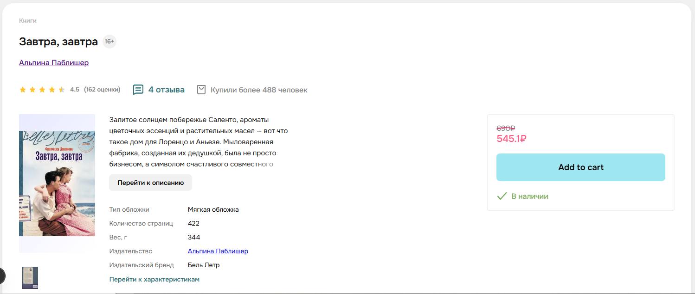
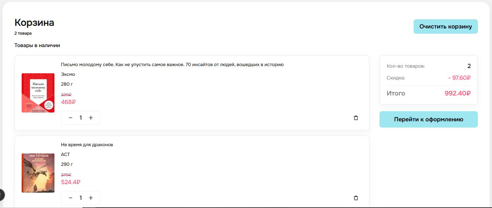

# Book-store.

### _Bookstore is a useful website for online purchase of books from various popular and less popular publishers. This website is an indispensable assistant for true book lovers._

---

Market page:


Book detail page:


Cart page:


## 📖 Оглавление

-   [About project](#-about-project)
-   [Technologies](#-technologies)
-   [Launch](#-launch)
-   [Functionality](#-functionality)
-   [Commands](#-commands)

## 🧐 About project

This site is designed to solve one of the main problems of today - buying rare, often sold-out copies of books that are not available in the stores of your city. This site will also help you simplify the search and purchase of the desired book, doing it in just a couple of clicks.

## 🛠 Technologies

-   **Frontend:** Next.js
-   **Backend:** Node.js
-   **Data base:** MongoDB

## 🚀 Launch

This instruction will help you to start restoring a project on your local computer.

### Prerequisites

-   Next.js
-   npm
-   MongoDB

### Installation

1. Clone the repository

```bash
git clone https://github.com/RenatAllakhyarov/frontend-template
cd your-project
```

2. Install NPM dependencies

```bash
npm install
```

3. Set up environment variables. Create a .env file and fill it NEXT_PUBLIC_API_BASE_URL=http://localhost:3000/

4. Start the development server

```bash
npm run dev
```

5. Open http://localhost:5173

## ✨ Functionality

✅ User registration and login

✅ Detailed view of books

✅ Adding books to cart and creating a transaction

✅ Responsive design

⏳ Implementation of work with an array of products that came from the backend instead of the mock one

## 📜 Commands

-   npm run dev - Run in development mode

-   npm run build - Build the project

-   npm start - Run the production build

-   npm test - Run tests
