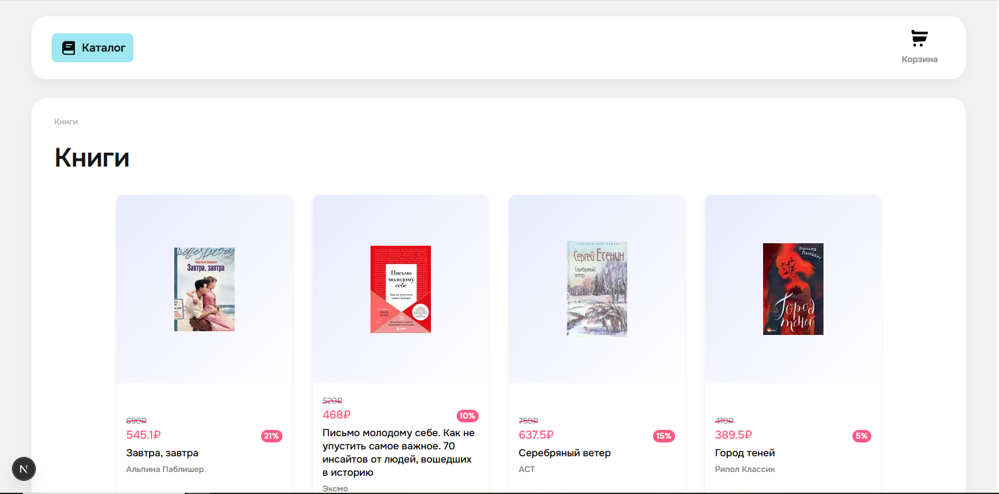

# Book Store 📚

### Your online destination for bestsellers and rare finds from publishers big and small. The indispensable assistant for true bibliophiles.



## ✨ Key Features

-   **Extensive Catalog:** Discover books from popular and indie publishers.
-   **Seamless Purchase:** Find and buy your desired book in just a few clicks.
-   **Detailed Previews:** Make informed decisions with detailed book pages.
-   **Secure Checkout:** A smooth and safe cart & transaction process.
-   **Fully Responsive:** A perfect shopping experience on any device.

---

## 📖 Table of Contents

- [Book Store 📚](#book-store-)
    - [Your online destination for bestsellers and rare finds from publishers big and small. The indispensable assistant for true bibliophiles.](#your-online-destination-for-bestsellers-and-rare-finds-from-publishers-big-and-small-the-indispensable-assistant-for-true-bibliophiles)
  - [✨ Key Features](#-key-features)
  - [📖 Table of Contents](#-table-of-contents)
  - [🧐 About The Project](#-about-the-project)
  - [🛠 Technologies Used](#-technologies-used)
  - [🚀 Getting Started](#-getting-started)
    - [Prerequisites](#prerequisites)
    - [Installation](#installation)

---

## 🧐 About The Project

This web application solves a modern problem: finding and purchasing rare, often out-of-stock books that are unavailable in local stores. It simplifies the search and buying process, making it possible to get your next great read in just a couple of clicks.

---

## 🛠 Technologies Used

-   **Frontend:** [Next.js](https://nextjs.org/)
-   **Backend:** Node.js, [Next.js API Routes](https://nextjs.org/docs/api-routes/introduction)
-   **Database:** MongoDB
-   **Styling:** CSS Modules

---

## 🚀 Getting Started

Follow these instructions to get a copy of the project up and running on your local machine for development and testing purposes.

### Prerequisites

Before you begin, ensure you have the following installed:

-   **Next.js**
-   **npm** package manager
-   **MongoDB**

### Installation

1.  **Clone the repository**

    ```bash
    git clone https://github.com/RenatAllakhyarov/frontend-template.git
    cd book-store
    ```

2.  **Install dependencies**

    ```bash
    npm install
    ```

3.  **Environment Setup**

    Set up environment variables. Create a .env file and fill it `NEXT_PUBLIC_API_BASE_URL=http://localhost:3000/`

4.  **Run the development server**

    ```bash
    npm run dev
    ```

5.  **Open your browser**
    Navigate to [http://localhost:5173](http://localhost:5173) to view the application.

---
